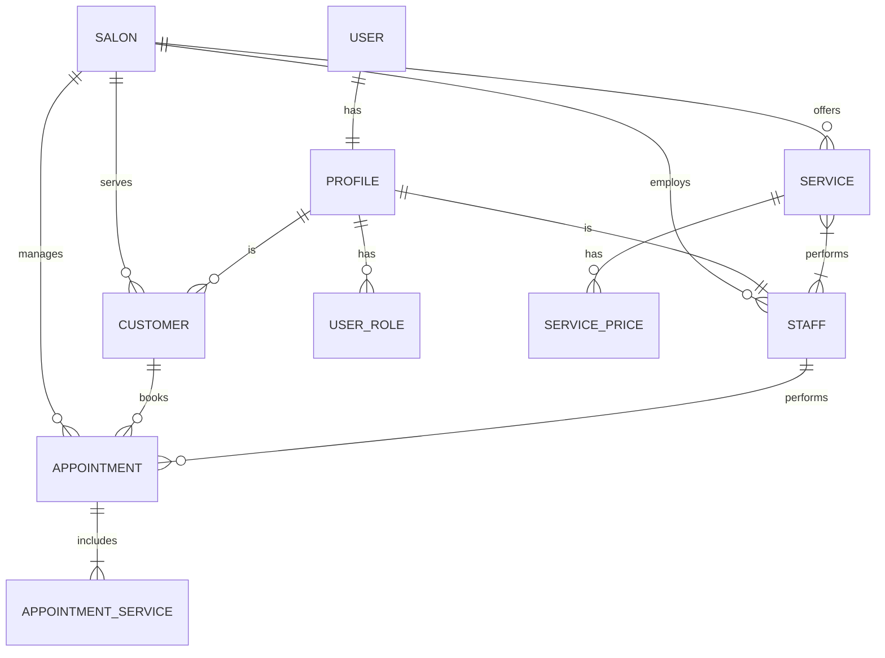

# Data Model

This document describes the database schema for SCHNITTWERK. The database is PostgreSQL, managed via Supabase.

## Core Entities

### Salons
The root entity. Supports multi-salon architecture, though initially used for a single location.
- `id`: UUID
- `name`: Text
- `slug`: Text (Unique)

### Users & Profiles
- `auth.users`: Supabase Auth table (managed by Supabase).
- `profiles`: Public profile data linked 1:1 to `auth.users`.
- `user_roles`: RBAC. Links `profiles` to `salons` with a `role` (admin, manager, mitarbeiter, kunde).

### Services
- `service_categories`: Grouping for services (e.g., Damen, Herren).
- `services`: The actual services offered.
- `service_prices`: Pricing history. Links service to a price and tax rate.

### Booking & Staff
- `staff`: Employees working at a salon. Linked to `profiles`.
- `staff_working_hours`: Weekly schedule.
- `appointments`: The core booking record.
- `appointment_services`: Services booked within an appointment.

### Rules & Configuration
- `booking_rules`: Configuration for lead times, cancellation policies, etc.
- `opening_hours`: Salon opening times.

## Schema Diagram (Mermaid)

## Enums

- `role_name`: `admin`, `manager`, `mitarbeiter`, `kunde`, `hq`
- `appointment_status`: `reserved`, `requested`, `confirmed`, `cancelled`, `completed`, `no_show`
- `day_of_week`: `monday`, ... `sunday`
